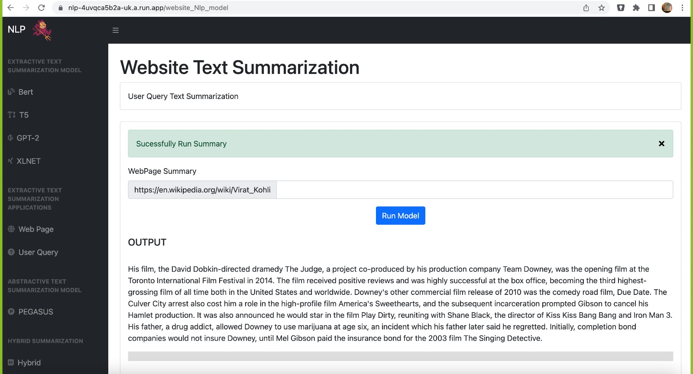

# NLP Text Summarization

Text Summarization Using NLP

Text summarizing has been utilized in various applications, including news media, social media, financial document analysis, video script analysis, medical science, etc. It offers a wide range of use cases for producing summaries from given documents or articles.

Suppose we use the news media sector as an example. In that case, a text summary is extremely beneficial in providing the facts from the document, which might help validate the news pertaining to numerous sources. Another point is that when we want a quick overview of a great news article, we typically skim it, reading the headlines first before moving on to the interesting part and, finally, the conclusion. However, what if the article is well summarized and provides the conclusion in two to three sentences rather than having to read the lengthy, time- consuming news article in its entirety. As a result, many applications are already on the market for text summarization, including Google News, Apple News, Microsoft News, Reddit News, etc. All of these products use text summarization to implement NLP.

Hence over here we explored a few of the Pretrained NLP Models and Custom Models and Trying to build our own Hybrid Model Using Abstractive and Extractive Text Summarization.

As we Know in the text summarization is categorized into two subcategory which is Extractive and Abstractive Text Summarization and Hence based on the above two categories we have come with several predefined model, Custom model and Hybrid model which are listed below that we have used as outcome.

•	Extractive Text Summarization Models
-	Bert
-	T5
-	GPT-2
-	XLNET

•	Abstractive Text Summarization Models
-	PEGASUS

•	Custom Model for Text Summarization Using Spacy and NLTK Module
-	Wikipedia or Web Page Text Analysis – Spacy and NLTK and HEAPQ
-	User Query text Summarization – Spacy and NLTK and HEAPQ

•	Hybrid text Summarization
-	Gensim, Heapq and Greedy Knapsack Algorithm  

## Deployment in GCP Cloud Run

Make Sure to run the command from location where Docker File Exist in Local

```sh
gcloud run deploy --project Your-Project_NAME-GCP
```

## Application Screenshot





